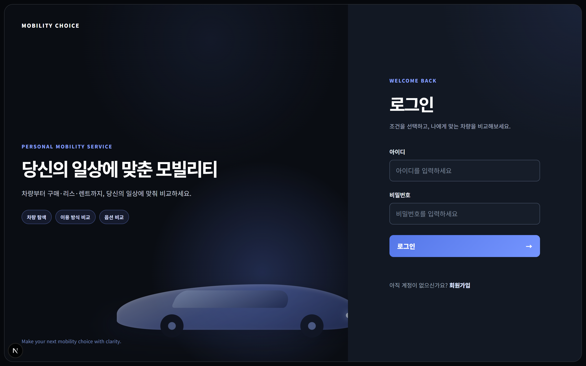
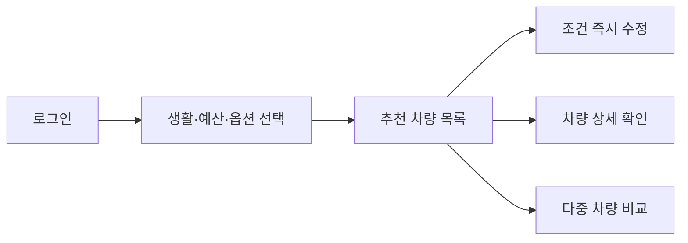
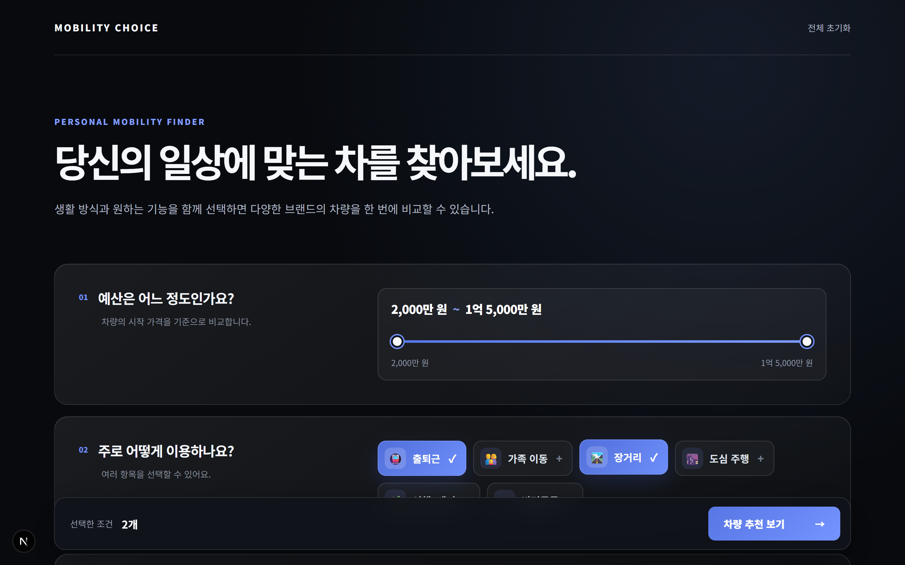
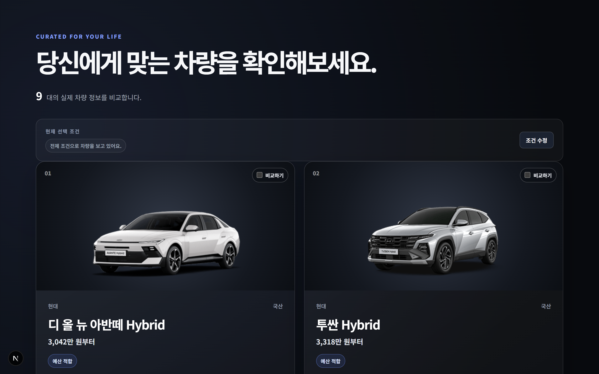
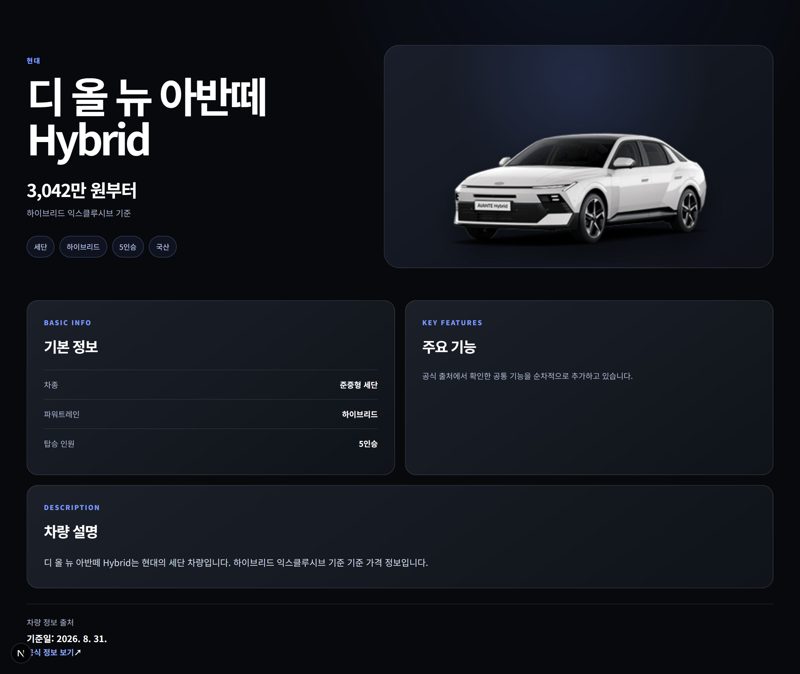
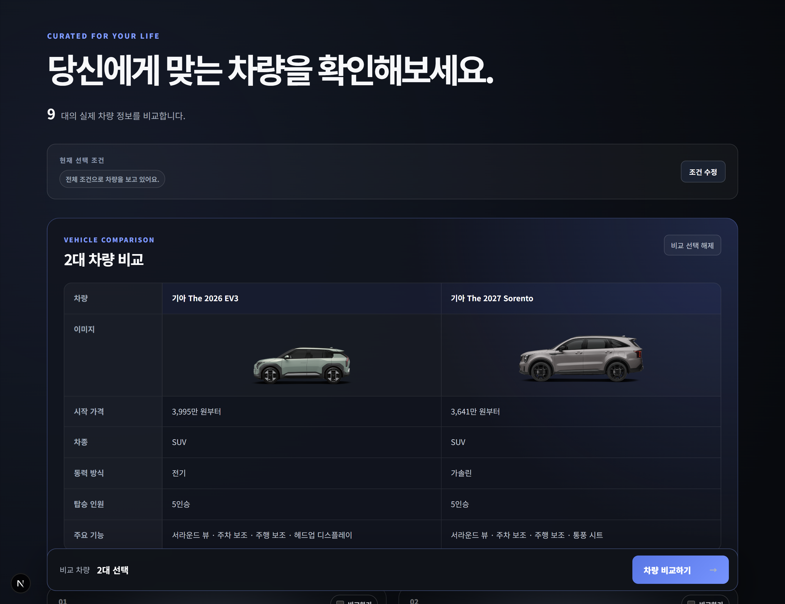
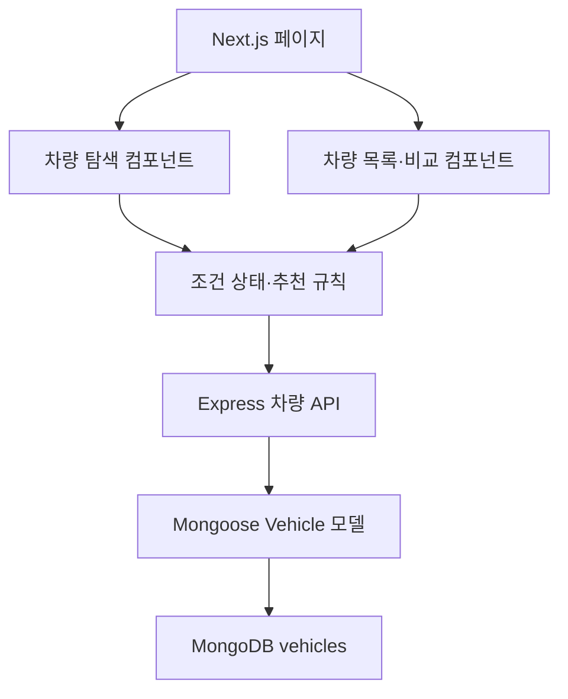

<div align="center">

# MOBILITY CHOICE

### 차량을 고르는 것이 아니라, 앞으로의 라이프스타일을 선택합니다.

생활 방식, 현재 조건, 예산, 선호 옵션을 함께 고려해
국산차와 수입차를 탐색하고 비교하는 개인화 차량 추천 서비스입니다.

<p align="center">
  
</p>
</div>

---

## 프로젝트 소개

차량을 구매할 때는 가격과 디자인만 고려할 수 없습니다.

출퇴근 거리, 가족 구성, 주차 환경, 장거리 운전 빈도, 여행과 레저 활동, 선호하는 편의 기능, 연료 방식, 구매 예산 등 여러 조건이 동시에 영향을 줍니다.

하지만 실제로 차량을 알아보는 과정에서는 제조사별 사이트와 차량 정보 플랫폼을 여러 번 오가며 정보를 검색해야 합니다. 선택지는 많지만 정보가 분산되어 있어 비교 기준을 세우는 데 시간이 걸리고, 검색 과정 자체에서 피로를 느끼기 쉽습니다.

Mobility Choice는 이러한 문제에서 시작했습니다.

> 사용자의 생활 방식과 조건을 먼저 이해하고, 그에 맞는 차량 후보와 추천 이유를 한 화면에서 보여줄 수 없을까?

차량을 단순한 이동 수단이나 구매 대상이 아니라 앞으로의 생활, 이동 시간, 가족과의 경험, 여가 활동을 함께 설계하는 공간으로 바라보고 차량 탐색 서비스를 구현했습니다.

---

## 문제 정의

기존 차량 탐색 과정에는 다음과 같은 어려움이 있습니다.

* 제조사와 브랜드마다 차량 정보가 분산되어 있습니다.
* 라이프스타일과 옵션을 함께 반영하기 어렵습니다.
* 여러 조건을 적용할수록 검색 과정이 길어집니다.
* 추천 결과가 나와도 추천 이유를 이해하기 어렵습니다.
* 후보 차량을 다시 검색해 비교해야 합니다.
* 구매·리스·렌트와 같은 이용 방식까지 함께 판단하기 어렵습니다.

Mobility Choice는 다음과 같은 방향으로 문제를 해결합니다.

1. 차량보다 사용자의 생활 조건을 먼저 선택합니다.
2. 생활 방식과 선호 옵션을 동시에 복수 선택합니다.
3. 국산차와 수입차를 하나의 목록에서 비교합니다.
4. 숫자 점수가 아니라 추천 이유를 설명합니다.
5. 추천 결과 화면에서 조건을 바로 수정합니다.
6. 여러 차량을 이미지와 주요 정보 중심으로 비교합니다.

---

## 핵심 사용자 흐름



---

## 주요 화면

### 1. 라이프스타일과 예산 설정

최소·최대 예산을 범위로 설정하고 생활 방식, 차종, 동력 방식, 우선순위, 희망 옵션을 중복 선택할 수 있습니다.

<p align="left">
  
</p>


### 2. 추천 차량 목록

선택한 조건을 바탕으로 차량 목록을 정렬하고, 차량마다 조건과 일치한 이유를 표시합니다.

<p align="left">
  
</p>


추천 이유 예시:

* 예산 적합
* 가족 이동 적합
* 출퇴근 적합
* 선호 차종 일치
* 동력 방식 일치
* 희망 옵션 포함
* 주차 편의 기능

### 3. 차량 상세 정보

차량 이미지, 가격, 차종, 동력 방식, 탑승 인원, 주요 기능과 제조사 공식 출처를 확인할 수 있습니다.

<p align="left">
  
</p>


### 4. 다중 차량 비교

비교하고 싶은 차량을 여러 대 선택하고 이미지와 주요 정보를 가로 비교할 수 있습니다.

<p align="left">
  
</p>


---

## 구현 기능

### 사용자

* 회원가입
* 로그인
* JWT 기반 사용자 인증
* 인증 정보 기반 차량 API 요청

### 차량 탐색

* 최소·최대 예산 설정
* 생활 방식 복수 선택
* 선호 차종 복수 선택
* 동력 방식 복수 선택
* 차량 선택 우선순위 설정
* 희망 옵션 복수 선택
* 구매·리스·렌트 이용 방식 선택
* 국산차·수입차 범위 선택
* 선택 조건 초기화

### 추천 결과

* 예산 범위에 맞는 차량 필터링
* 조건 일치 개수를 기준으로 차량 정렬
* 차량별 추천 이유 표시
* 추천 결과 화면에서 조건 즉시 수정
* 차량 상세 페이지 이동
* 다중 차량 선택 및 비교

### 차량 정보

* 실제 출시 차량 데이터 사용
* 제조사 공식 페이지 출처 저장
* 차량 정보 확인일 저장
* 로컬 차량 이미지 제공
* MongoDB 시드 스크립트를 이용한 데이터 재현

---

## 기술 스택

### Frontend

| 기술                 | 사용 이유                                                      |
| ------------------ | ---------------------------------------------------------- |
| Next.js App Router | 로그인, 탐색, 목록, 상세 페이지를 URL 단위로 명확하게 분리하기 위해 사용했습니다.          |
| React              | 다중 조건 선택, 예산 범위, 차량 비교 등 사용자 상태 변화가 많은 화면을 구성하기 위해 사용했습니다. |
| CSS Modules        | 로그인, 탐색, 목록, 상세 화면의 클래스명이 서로 충돌하는 문제를 방지하기 위해 사용했습니다.      |
| Next Image         | 차량 이미지를 화면 크기에 맞게 안정적으로 표시하고 이미지 영역의 레이아웃을 유지하기 위해 사용했습니다. |
| sessionStorage     | 탐색 화면에서 선택한 조건을 차량 목록 화면으로 전달하고 현재 탭에서 유지하기 위해 사용했습니다.     |
| localStorage       | 로그인 후 발급받은 JWT를 API 요청에 사용하기 위해 적용했습니다.                    |

### Backend

| 기술       | 사용 이유                                                                 |
| -------- | --------------------------------------------------------------------- |
| Node.js  | 프론트엔드와 동일한 JavaScript 언어로 서버 로직을 구현하기 위해 사용했습니다.                      |
| Express  | 인증과 차량 조회 API를 비교적 단순하고 명확한 REST 구조로 구성하기 위해 사용했습니다.                  |
| MongoDB  | 차량별 옵션과 제원처럼 배열 구조가 많고 차량마다 세부 항목이 달라질 수 있는 데이터를 유연하게 저장하기 위해 사용했습니다. |
| Mongoose | 차량 데이터의 필수 필드, 자료형, 기본값을 스키마로 관리하기 위해 사용했습니다.                         |
| JWT      | 로그인한 사용자의 API 접근 여부를 확인하기 위해 사용했습니다.                                  |
| bcrypt   | 비밀번호를 원문으로 저장하지 않고 해시 처리하기 위해 사용했습니다.                                 |

---

## 구조 설계

서비스는 화면, 재사용 UI, 추천 규칙, API, 데이터 저장 책임을 구분하는 방향으로 구성했습니다.



### 컴포넌트 분리 기준

초기에는 조건 선택과 차량 목록 코드를 각 페이지 파일에 직접 작성했습니다. 기능이 늘어나면서 페이지 코드가 길어지고 예산 레인지, 토글 버튼, 차량 카드 코드가 중복되는 문제가 발생했습니다.

이를 개선하기 위해 다음 기준으로 컴포넌트를 분리했습니다.

| 컴포넌트                | 책임                       |
| ------------------- | ------------------------ |
| `BudgetRange`       | 최소·최대 예산 선택              |
| `FilterBlock`       | 단계 번호, 제목, 설명이 포함된 조건 블록 |
| `OptionToggle`      | 아이콘과 선택 상태를 포함한 토글 버튼    |
| `OptionFilterBlock` | 하나의 조건 그룹과 선택지 목록        |
| `VehicleImage`      | 이미지 로딩과 대체 화면            |
| `VehicleCard`       | 목록에 표시되는 차량 정보           |
| `VehicleComparison` | 여러 차량의 이미지와 정보를 비교       |
| `VehicleUtils`      | 차량명, 가격, 추천 이유 등 공통 계산   |
| `filterData`        | 조건 그룹, 아이콘, 기본 예산 데이터    |

---

## UI 설계 방향

### 블랙 기반의 프리미엄 디자인

차량은 한 번 선택하면 오랜 기간 일상과 이동 방식에 영향을 줍니다. 신중한 탐색이 필요한 서비스라는 점을 반영해 검은색과 짙은 네이비를 기본 배경으로 사용했습니다.

밝은 배경보다 차량 이미지와 핵심 정보가 선명하게 드러나도록 구성했으며, 파란색을 조건 선택과 주요 행동을 나타내는 강조 색상으로 사용했습니다.

사용자가 많은 정보를 한꺼번에 읽지 않아도 되도록 예산, 생활 방식, 차종, 동력 방식, 선호 옵션을 단계별 선택 영역으로 나눴습니다. 차량 목록에서는 단순 점수 대신 ‘예산 적합’, ‘가족 이동 적합’과 같이 추천 이유를 이해할 수 있도록 표현했습니다.

### 조건별 아이콘

차종과 옵션 이름만 나열하면 조건이 많아질수록 탐색 피로가 커집니다. 각 선택지에 의미가 연결되는 아이콘을 배치해 사용자가 조건을 빠르게 구분할 수 있도록 했습니다.

### 복수 선택 방식

실제 사용자는 하나의 조건만 가지고 차량을 고르지 않습니다. 가족 이동과 출퇴근, 공간과 안전, 전기차와 SUV처럼 여러 기준을 함께 고려할 수 있도록 대부분의 조건을 복수 선택 방식으로 설계했습니다.

### 추천 점수 대신 추천 이유

초기에는 차량 카드에 `조건 7점`과 같은 점수를 표시했습니다. 하지만 점수만으로는 차량이 왜 추천됐는지 이해하기 어려웠습니다.

이를 다음과 같은 설명형 태그로 변경했습니다.

* 예산 적합
* 가족 이동 적합
* 희망 옵션 포함
* 선호 차종 일치

추천 결과의 숫자보다 사용자가 이해할 수 있는 근거를 전달하는 데 초점을 맞췄습니다.

### 조건 즉시 수정

추천 결과가 마음에 들지 않을 때 탐색 페이지로 계속 돌아가야 하는 불편을 줄이기 위해 차량 목록 상단에서 선택 조건을 바로 수정할 수 있도록 구성했습니다.

---

## 차량 데이터 관리 원칙

프로젝트의 차량 데이터는 임의로 만든 가상 차량이 아니라 실제 출시 차량을 기준으로 작성했습니다.

각 차량 데이터에는 다음 항목을 저장합니다.

* 브랜드와 모델명
* 국산·수입 구분
* 차종
* 동력 방식
* 탑승 인원
* 시작 가격
* 가격 기준
* 주요 제원
* 주요 기능
* 공식 정보 URL
* 정보 확인일
* 이미지 경로

차량 가격과 옵션은 트림, 선택 사양, 세제 혜택과 시점에 따라 달라질 수 있으므로 `priceNote`, `featureNote`, `sourceCheckedAt`을 함께 저장하도록 설계했습니다.

---

## 이미지 처리 개선

초기에는 제조사 공식 이미지 URL을 화면에서 직접 불러오는 방식을 사용했습니다.

일부 제조사 서버가 외부 사이트에서의 이미지 요청을 제한하거나 이미지 주소를 변경하면서 차량별로 이미지가 표시되지 않는 문제가 발생했습니다.

이를 개선하기 위해 다음 방식으로 변경했습니다.

1. 공식 이미지 URL 목록을 관리합니다.
2. 다운로드 스크립트로 이미지를 내려받습니다.
3. `frontend/public/vehicles`에 저장합니다.
4. MongoDB에는 로컬 이미지 경로를 저장합니다.

이 방식으로 외부 서버 정책에 따른 이미지 누락을 줄이고 동일한 개발 환경을 재현할 수 있도록 했습니다.

---

## 프로젝트 구조

```text
mobility-choice-service/
├─ backend/
│  ├─ config/                    # JWT 인증 설정
│  ├─ data/                      # 차량 초기 데이터
│  ├─ middlewares/               # 인증 미들웨어
│  ├─ models/                    # User, Vehicle Mongoose 모델
│  ├─ requests/
│  │  └─ api.http                # WebStorm HTTP Client API 테스트
│  ├─ scripts/                   # 차량 데이터·이미지 준비 스크립트
│  ├─ .env.example
│  ├─ package.json
│  └─ server.js
│
├─ frontend/
│  ├─ public/
│  │  └─ vehicles/               # 차량 카드 및 상세 화면 이미지
│  ├─ src/
│  │  ├─ app/
│  │  │  ├─ explore/             # 생활 조건·예산 선택 화면
│  │  │  ├─ register/            # 회원가입 화면
│  │  │  ├─ vehicles/            # 차량 목록·상세 화면
│  │  │  ├─ globals.css
│  │  │  ├─ layout.js
│  │  │  └─ page.js              # 로그인 화면
│  │  └─ components/
│  │     └─ vehicle-finder/      # 조건 선택·차량 카드·비교 UI 컴포넌트
│  ├─ .env.example
│  ├─ next.config.mjs
│  └─ package.json
│
├─ docs/
│  └─ images/                    # README 화면 캡처
├─ .gitignore
└─ README.md
```

---

## 로컬 실행 방법

### 1. 프로젝트 복제

```bash
git clone https://github.com/본인아이디/저장소이름.git
cd mobility_choice_service
```

### 2. Backend 설정

```bash
cd backend
npm install
```

`backend/.env` 파일을 생성합니다.

```env
PORT=4000
MONGODB_URI=mongodb://127.0.0.1:27017/mobility_choice_service
JWT_SECRET=충분히_긴_임의의_문자열
```

차량 데이터를 MongoDB에 등록합니다.

```bash
npm run seed:vehicles
```

Backend를 실행합니다.

```bash
npm run dev
```

### 3. Frontend 설정

새 터미널에서 실행합니다.

```bash
cd frontend
npm install
```

`frontend/.env.local` 파일을 생성합니다.

```env
NEXT_PUBLIC_API_BASE_URL=http://localhost:4000
```

Frontend를 실행합니다.

```bash
npm run dev
```

브라우저에서 접속합니다.

```text
http://localhost:3000
```

---

## API

| Method | Endpoint             | 설명       |
| ------ | -------------------- | -------- |
| POST   | `/api/auth/register` | 회원가입     |
| POST   | `/api/auth/login`    | 로그인      |
| GET    | `/api/vehicles`      | 차량 목록 조회 |
| GET    | `/api/vehicles/:id`  | 차량 상세 조회 |

---

## 현재 단계

현재 프로젝트는 핵심 사용자 흐름을 확인할 수 있는 MVP 단계입니다.

완료된 범위:

* 로그인과 회원가입
* 실제 차량 데이터 저장
* 조건 탐색
* 추천 결과 제공
* 추천 이유 설명
* 차량 상세 정보
* 결과 화면에서 조건 수정
* 다중 차량 비교
* 공통 UI 컴포넌트 분리

현재 등록 차량은 제한적이며 추천 로직도 규칙 기반으로 구현되어 있습니다. 실제 서비스로 발전시키려면 데이터 범위와 추천 근거를 계속 확장해야 합니다.

---

## 향후 개선 계획

* 더 많은 국내외 차량과 트림 데이터 추가
* 차량 정보 자동 갱신 구조 설계
* 생활 방식별 추천 가중치 고도화
* 추천 이유와 데이터 근거 연결
* 구매·리스·렌트 예상 월 비용 비교
* 사용자별 관심 차량 저장
* 비교 이력 저장
* 차량별 유지비·보험료·충전 환경 반영
* 모바일 화면 최적화
* API와 추천 로직 테스트
* 배포 환경 구성

---

## 프로젝트가 지향하는 방향

차량을 구매하는 일은 물건 하나를 고르는 것보다 앞으로의 생활 방식 일부를 선택하는 일에 가깝습니다.

어디로 이동할지, 이동하는 시간을 어떻게 보낼지, 누구와 함께할지, 어떤 경험을 더 자주 만들지를 결정하는 과정이기도 합니다.

Mobility Choice는 차량 제원만 나열하는 서비스가 아니라 사용자가 자신에게 중요한 조건을 발견하고 더 나은 이동 생활을 선택하도록 돕는 서비스를 지향합니다.
